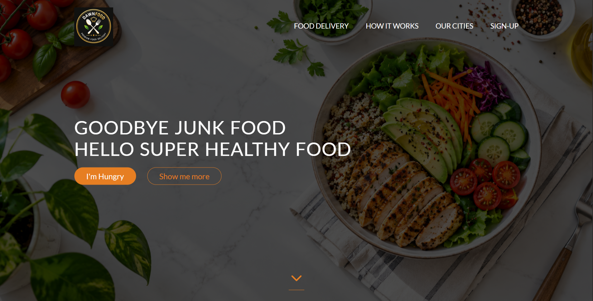
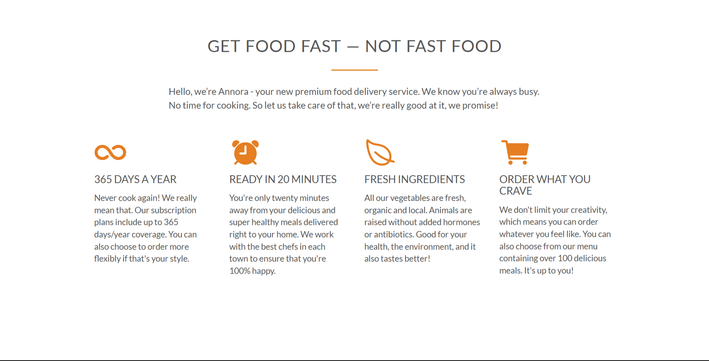
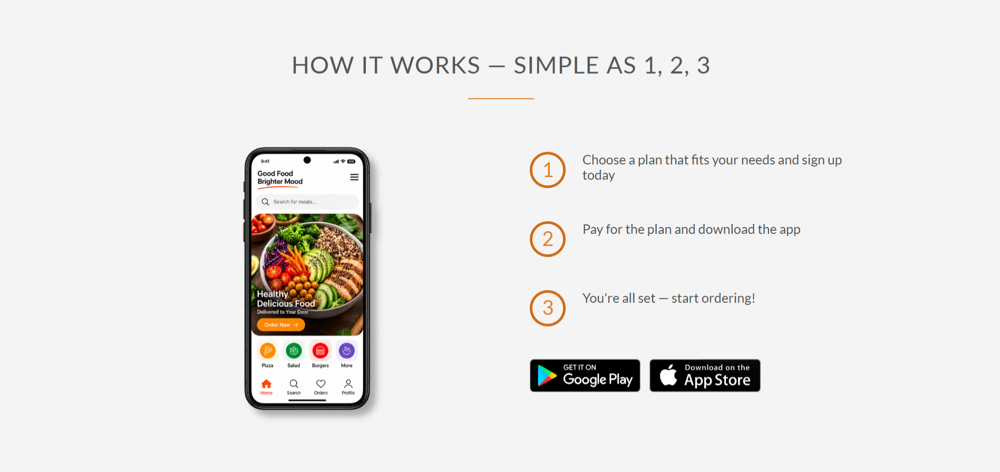
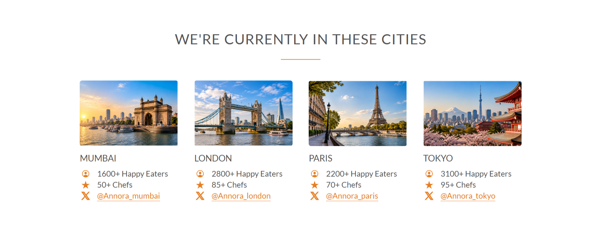
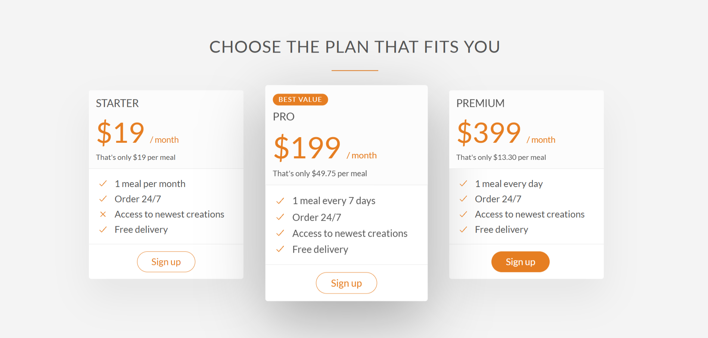
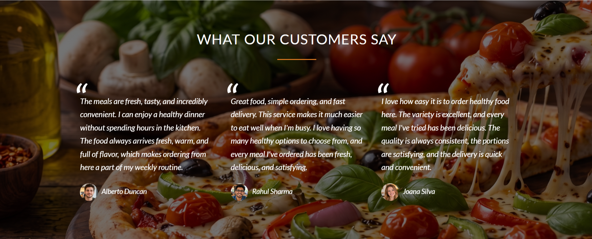
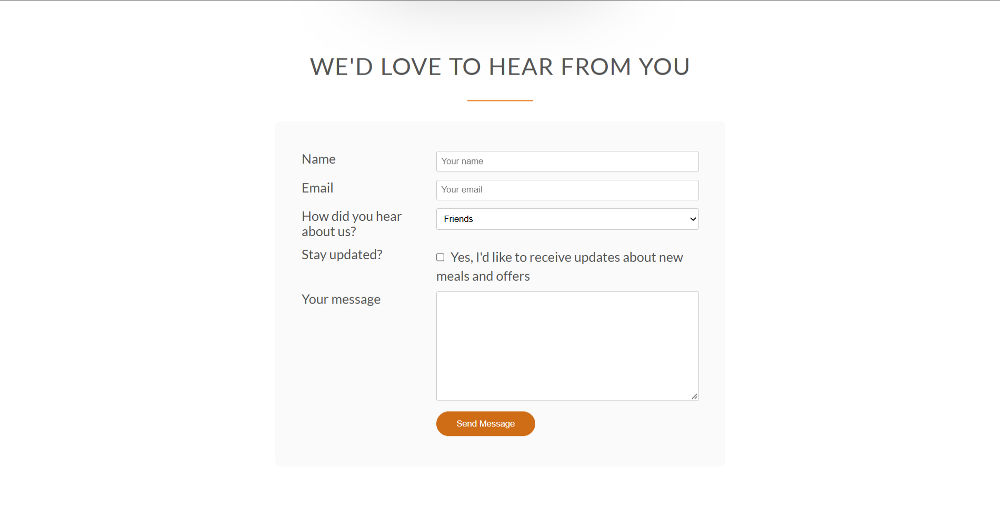

# 🍔 Annora Food Delivery Landing Page

A clean, responsive landing page for **Annora**, a fictional premium food delivery service. Built with pure HTML and CSS, featuring a hero section, feature highlights, "how it works" steps, city coverage, testimonials, and a signup form.

---

## 🚀 Live Demo

| Resource | Link |
|---|---|
| 🌐 Live Site | *Add your GitHub Pages / hosting link here* |
| 📂 Repository | *Add your repo link here* |

---

## 📸 Screenshots

| Hero Section | Features |
|---|---|
|  |  |

| How It Works | Cities / Food Coverage |
|---|---|
|  |  |

| Plans | Testimonials |
|---|---|
|  |  |

| Signup | Footer |
|---|---|
|  |  |

---

## 🛠️ Built With

- **HTML5** — page structure and semantic markup
- **CSS3** — custom styling (`style.css`, `queries.css`) + responsive grid (`grid.css`, `normalize.css`)
- **jQuery** — smooth scrolling and mobile menu toggle
- **AOS (Animate On Scroll)** — scroll-triggered animations
- **Ionicons** — icon set used throughout the UI
- **Google Fonts** — Lato typeface

---

## 📁 Project Structure

```
FOOD-PROJECT/
├── index.html
├── resources/
│   ├── css/
│   │   ├── style.css
│   │   ├── queries.css
│   │   └── img/
│   │       ├── back-cust.png
│   │       └── hero-image.png
│   └── img/
│       ├── Logo.png
│       ├── 1.jpg ... 8.png
│       ├── cust-1.jpg, cust-2-indian.jpg, cust-3.jpg
│       ├── london.jpg, mumbai-india.jpg, paris.jpg, tokyo.jpg
│       ├── app-store.png, google-play.png
│       └── phone-preview.png
└── venders/
    └── css/
        ├── grid.css
        └── normalize.css
```

---

## ✨ Features

- 🍽️ Hero section with call-to-action buttons
- ⚡ Feature highlights (365-day service, fast delivery, etc.)
- 🔢 "How it works" step-by-step section
- 🌍 City coverage showcase (London, Mumbai, Paris, Tokyo)
- 💰 Subscription plans section
- 💬 Customer testimonials
- 📧 Contact / signup form with footer
- 📱 Fully responsive (mobile menu toggle included)
- 🎞️ Scroll animations via AOS

---

## 🧠 What I Learned

- Structuring a multi-section landing page with semantic HTML
- Building a responsive layout using a custom grid system
- Adding scroll-based animations with AOS
- Implementing smooth scrolling and a mobile nav toggle with jQuery

---

## 👤 Author

**Anant Kumar Agarwal**
- GitHub: [@anantagarwal1307](https://github.com/anantagarwal1307)

---

## 📄 License

This project is licensed under the **MIT License** — see the [LICENSE](LICENSE) file for details.
